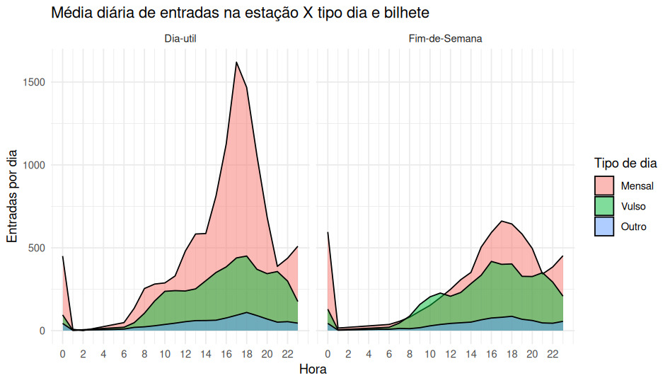
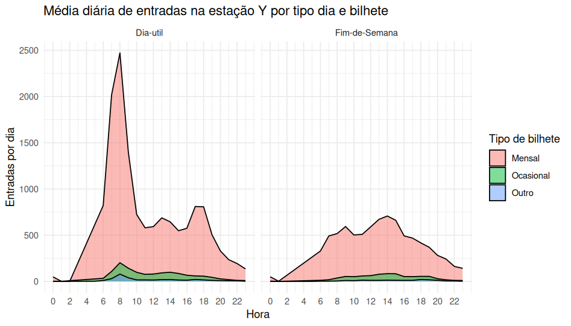

```{r setup, include=FALSE}
knitr::opts_chunk$set(echo = FALSE,
                      message = FALSE,
                      warning = FALSE)
```

```{r}
library(tidyverse)
```

# Introdução

O Metropolitao de Lisboa facultou dados de registo de entradas e saídas de duas estações de metro, para dois meses de 2024.

Os dados foram cedidos exclusivamente para exercícios de análise de dados no âmbito das aulas de **Literacia sobre dados abertos em transportes**[^1], módulo da [Pós-Graduação Mobilidade 360º Gestão de Transportes](https://execed.iscte-iul.pt/applied-online-pos-graduacao-em-mobilidade-360-gestao-de-transportes) do Iscte Executive Education, sob coordenação de Dra.
Mariza Queiroz.

[^1]: Ver materiais em: [rosamfelix.github.io/PGmob360](https://rosamfelix.github.io/PGmob360/){.uri}

Neste documento apresentam-se as características dos dados fornecidos, as opções de simplificação dos mesmos, os resultados dos trabalhos de grupos, e outras possíveis análises e resultados, utilizando o software estatístico *R*.

Apesar de serem dados muito ricos para extrair padrões e outras análises, não foi possível ir a fundo nas análises realizadas pelos alunos durante o exercício em sala de aula, uma vez que a familiaridade com o software ainda era recente.
No entanto, sugere-se que o Metro de Lisboa possa facultar os mesmos dados (ou mais antigos, e truncados) para outras aulas de mobildiade e transportes, uma vez que os mesmos têm um enorme potencial de análise exploratória, cujos resultados podem constituit mais-valia para o Metropolitano de Lisboa.

# Dados

## Registos de entradas e saídas

> Descrição dos dados recebidos e simplificações.

## Títulos

Foi fornecida uma base de dados com a descrição dos códigos dos títulos disponíveis.

Por uma questão de simplificação, optou-se por agrupar vários títulos de perfil semelhante, de modo a obter um número parcimonioso de diferentes títulos, a saber:

-   **Passe mensal**: inclui Navegante metropolitano, Navegante municipal, Sub23, +65, e todos aqueles que permitem viajar na rede sem restrições durante um mês.

-   **Título ocasional**: inclui os títulos de carácter ocasional, como zapping, ida, ida e volta, 24 horas - 72 horas.

-   **Outros**: neste incluem-se os trabalhadores das estações de metro, vouchers, e outros títulos cujo sentido não foi decifrável.

Outras categorias poderiam ter sido criadas, como as referentes a **idades** dos utilizadores, para aferir sobre diferentes perfis de viagem, ou referentes a **visitantes** ou turistas.

# Exercício proposto

A partir dos dados de entradas e saídas de duas estações de metro, pretende-se:

1.  Identificar um padrão horário / semanal de registos

2.  Analisar o tipo de bilhete usado e sua proporção, e eventualmente reclassificar

3.  Analisar o número de registos realizados pelo mesma pessoa num mês

4.  **Outras análises** que considere interessantes!

5.  Relacionar estes dados com o tipo / localização da estação na cidade de Lisboa (sugestão de onde será)

6.  Comparar os resultados entre os grupos

Cada um dos 4 grupos ficou com um conjuto de dados:

-   [Grupo 1](#g1): Estação Baixa-Chiado - Entradas
-   [Grupo 2](#g2): Estação Baixa-Chiado - Saídas
-   [Grupo 3](#g3): Estação Odivelas - Entradas
-   [Grupo 4](#g4): Estação Odivelas - Saídas

Por uma questão de limitação de re-utilização dos dados, foi anonimizado o nome da Estação de Metro (Baixa-Chiado - *Estação X*, Odivelas - *Estação Y*), tendo sido proposto que sugerissem que estação era a partir dos padrões de registos.
Não foi confirmado se a resposta estaria correta, serviu apenas para discussão dos padrões resultantes das análises de dados.

# Análises

## Dos alunos

Estas análises ficaram limitadas pelo tempo disponível na aula prática, e pela relativa recente familiaridade com o software R.

Os alunos conseguiram carregar os dados (mais de 1 milhão de entradas), e fazer algumas operações simples, como juntar a tabela de descrição de títulos, ou agrupar o número de viagens por título.

As análises apresentadas ficaram um pouco aquém do que poderia ter sido feito, embora se reconheça que talvez se estivesse a pedir demais numa fase tão iniciante.

> continuar sobre os resultados a que chegaram, em cada um

### Grupo 1: Estação Baixa-Chiado - Entradas {#g1}

Grupo composto por Bruno Parreira, Gabriella Almeida, Marta Laborinho, e Nuno Vitor.

\includepdf[pages=-, nup=1x2, scale=0.9]{Grupo1_EstacaoX_entradas.pdf}

### Grupo 2: Estação Baixa-Chiado - Saídas {#g2}

Grupo composto por Carla Grácio, Ivo Calha, Pedro Fernandes, e Tiago Silva.

\includepdf[pages=-, nup=1x2, scale=0.9]{Grupo2_EstacaoX_saidas.pdf}

### Grupo 3: Estação Odivelas - Entradas {#g3}

Grupo composto por Adriana Toco, Delfina Tomé, Nuno Melo, e Rita Rodrigues.

\includepdf[pages=-, nup=1x2, scale=0.9]{Grupo3_EstacaoY_entradas.pdf}

### Grupo 4: Estação Odivelas - Saídas {#g4}

Grupo composto por Joana Vasconcelos, Marco Vasconcelos, Pedro Pinto, e Tiago Cardoso.

\includepdf[pages=-, nup=1x2, scale=0.9]{Grupo4_EstacaoY_saidas.pdf}

## Outras análises

> Colocar aqui a descrição do código, e fazer mais 2 análises diferentes.




